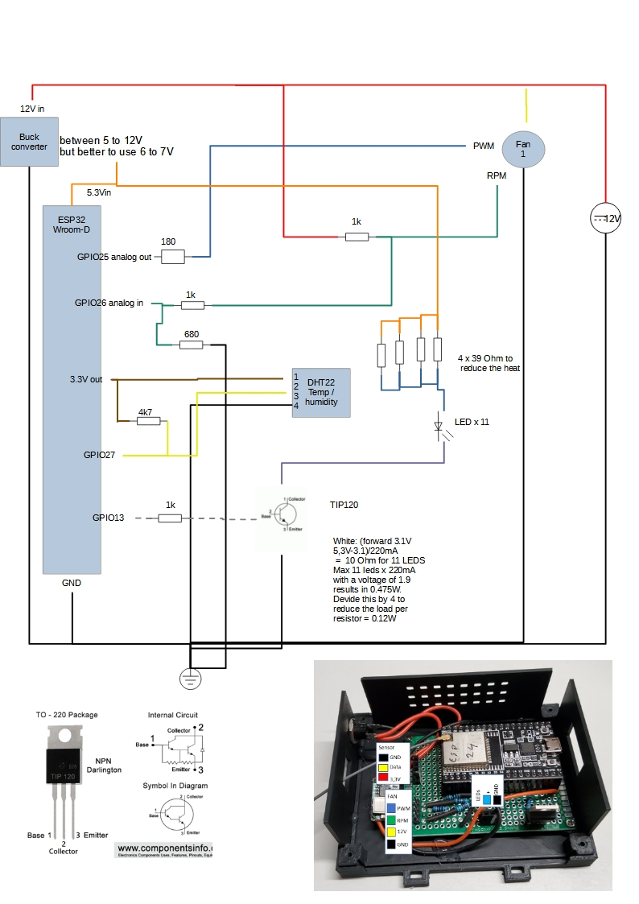

# Fan bathroom
This ESP32 controls the fan of the badroom and is it also might look right and just because I can I added lights to the fan. The fan is an in-line fan, where the cover in the bathroom itself is just for providing a nice cover for the 120mm airgap.

## Description and operation instructions
The fan is turned on when a certain humidity is detected and turned off when it is below another humidity value. The fan is controlled via different levels where at lower humidity levels the fan runs at a lower speed and when the hunidity level is high the fan runs at a higher speed. The fan is also turned on when the temperature is very high. The logic is running on the ESP32, so even if HomeAssistant is down the fan operates independently. To be able to override the logic there is an override variable which enables remote control and bypasing the ESP32 fan control.
The LEDs are just for fun and can be controlled manually or like in my case via HomeAssistant where some logic is in NodeRed to control the LEDs.

 ## Technical description
The PWM fan is controlled via the PWM signal coming from the ESP32. The ESP32 is running ESPHOME and connected to Home Assistant. The sensor for the humidity is included in this module, the LEDs of the fan are connected to this ESP32, but they only can be contolled via Home Assistant and an external motio sensor.
The construction is made modular to enable easy printing and mounting. I used magnets to easily remove parts, not only for mounting, but also for cleaning. The fan fits a 120mm pipe. 

### Parts
1 x ESP32

1 x DHT22 or AM2302

1 x DHT22 or AM2302 vs DHT11

1 x Fan NF-F12 IP2000-67 Noctua NF-F12 industrialPPC-2000 IP67, 120mm

Fan pinout pinout

1 x Mini360 DC- DC buck converter

Resistors
1 x 180 0,25W
1 x 680 0,25W
3 x 1k 0,25W
1 x 4k7 0,25W
4 x 33 0,5W

1 x TIP120 Darlington transistor

11 x LED warm white 5mm

1 x 5.5 x 2.1 connector

1 x 12V DC adapter

60cm heatshrink tube to group the wires running thru the fan pipes

Some small screws
2 x M2 x 6 mm
2 x M2 x 8 mm

For the piping use 120 pipes to fit your needs

### Schematic overview

 
Connector connections overview

•	Power the circuit only via 12V and run code updates via OTA and ESPHOME.

### ESPHOME Configuration
### ESPHome Configuration in Home Assistant
Create a new ESPHOME device with this code:
### Code
[Code in ESPHOME](code.vbs)

### 3D printer files
[3D Printer files](3D_Printer_Files)
#### ESP box
1 x ESP bottom 01.stl
1 x ESP Top 01.stl
2 x ESP side long 01.stl
1 x ESP side short cables in 01.stl
1 x ESP side short USB side 01.stl

#### Bathroom cover
1 x Inner fan ceiling mount cover 02 curved edges yellow 1mm.stl
1 x Inner fan ceiling mount cover matching the loose pipe model 04.stl
1 x Inner fan ceiling mount loose pipe model 02.stl
1 x Inner fan ceiling mount loose pipe of loose pipe model 02.stl

#### 120mm connections in the pipes
1 x Connection fan 03.stl
1 x Connection fan extended 01.stl
2 x Seal for fan 01.stl  to connect between the fan and the 3D printed parts

